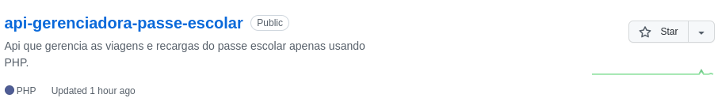
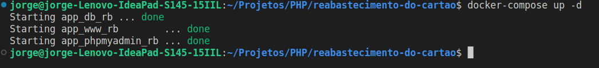
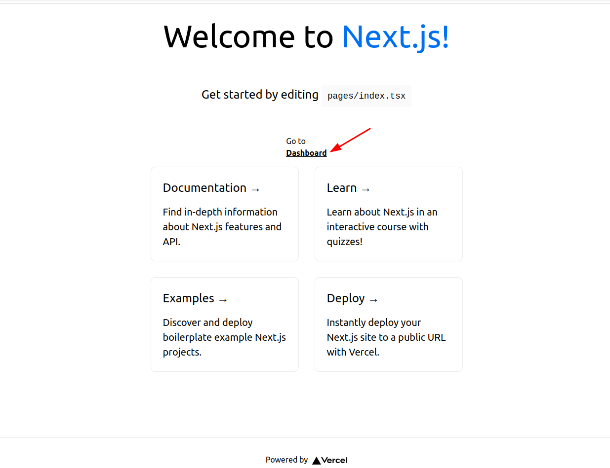
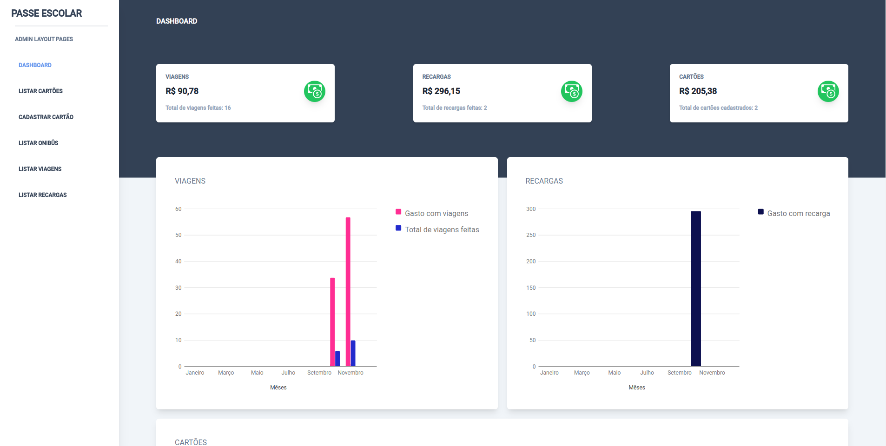
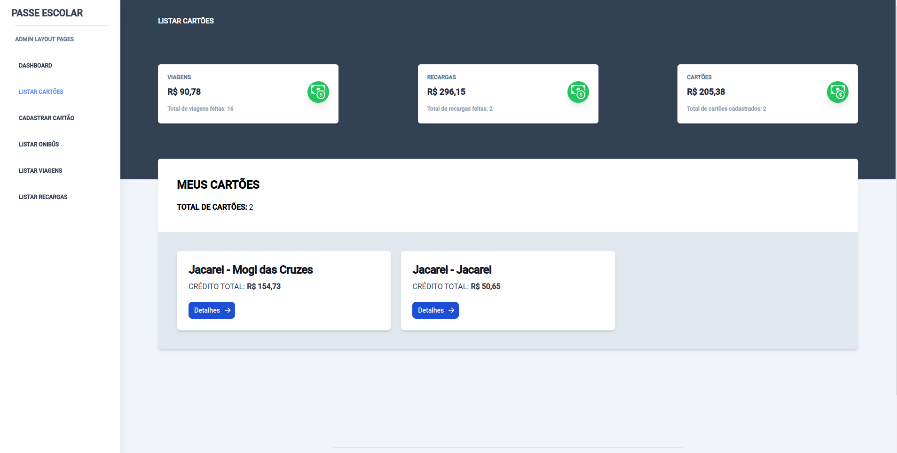
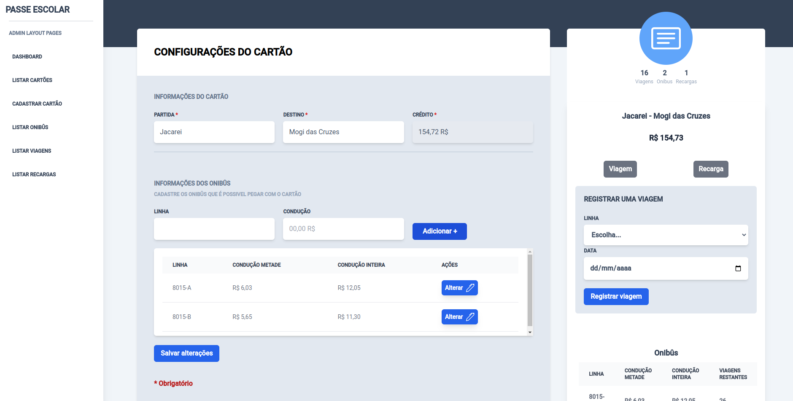
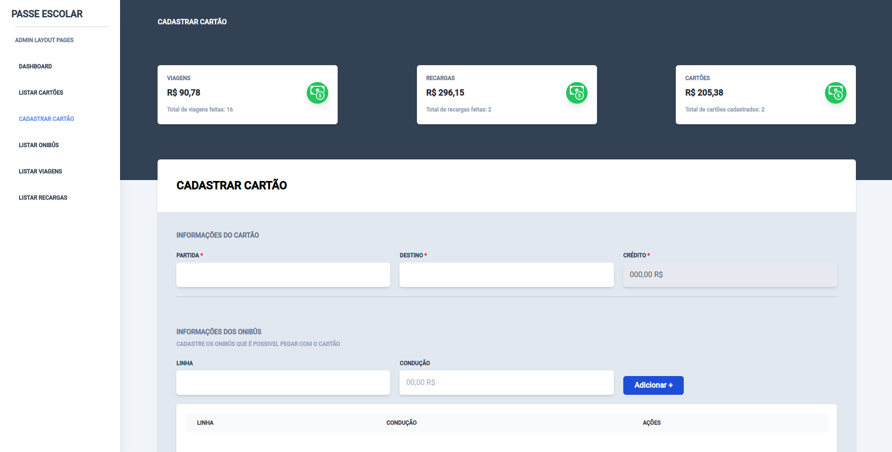
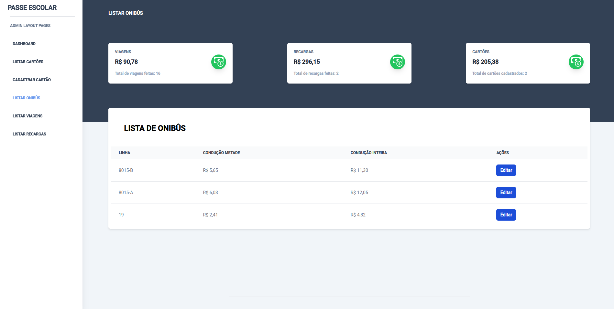
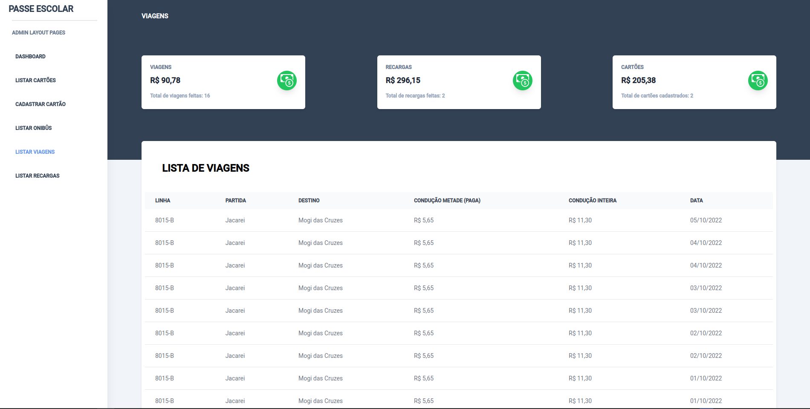
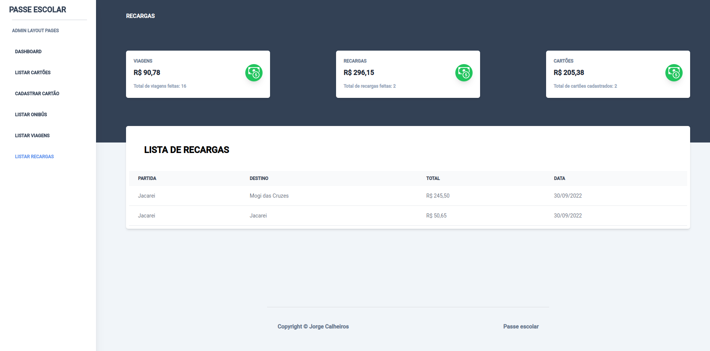

# Sistema de gerenciamento de passe escolar

## Requisitos
- Node
- Ter o repositorio [api-gerenciadora-passe-escolar](https://github.com/Jorge-Calheiros-de-Sousa/api-gerenciadora-passe-escolar) executando

## Vamos começar

Clone o repositorio api gerenciadora de passe escolar



---


Mantenha-o executando



---


E depois nesse repositorio execute os comandos abaixo
```bash

npm i

npm run dev

```

Abra [localhost:3000](http://localhost:3000 ) com o seu navegador e vejá o resultado.

## Para aprender mais

Para aprender mais sobre Next.js e FireBase, acesse os links abaixo:

- [Documentação | Next.js](https://nextjs.org/docs)
- [Documentação | Firebase](https://firebase.google.com/docs?gclid=Cj0KCQjwxIOXBhCrARIsAL1QFCZ1LD27_i9K-nEKbL5t7RO5llDksTbDH2V5EVJd1FOSZjxhQrT_8TsaAknMEALw_wcB&gclsrc=aw.ds)
 

---
## Telas

- Index


---
- Dashboard

---

- Listar cartões

---

- Informações do cartão

---

- Cadastro de cartões

---

- Listar onibûs

---

- Listar viagens

---

- Listar recargas
